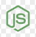

# Juan Matias Gema | Full Stack Developer

Hello! 👋 I am **Juan Matias Gema**, a passionate **Full Stack** designer with a stronger inclination towards **backend** development. I have experience in building robust and scalable systems, focusing on creating reliable structures that solve real-world problems.

---

## 🚀 Main Technologies and Skills:

### 🛠 Languages and Frameworks:

1.  **JavaScript | TypeScript**
2.  **React | NextJs**
3. 
   **NestJs | Express**
4. 
   **NodeJs**
5.  **WebSocket**

### 🗄 Databases:

1.  **PostgreSQL**
2.  **MongoDB**

### 🎨 Frontend Development Tools:

1.  **HTML5**
2.  **CSS**
3.  **Bootstrap**
4.  **TailwindCSS**

### 💻 Environments:

1.  **Windows**

---

## 📌 My Focus:

1.  **Design and development of efficient and secure APIs.**
2.  **Implementation of industrial architectures in backend using NodeJs and NestJs.**
3.  **Development of interactive frontend applications with NextJs and TailwindCSS.**
4.  **Management and optimization of relational and non-relational databases.**

---

## 📞 Contact:

1.  **LinkedIn:** [Juan Matias Gema](https://www.linkedin.com/in/matias-gema)
2.  **Instagram:** [@mati.gema](https://www.instagram.com/mati.gema)
3.  **Personal Phone:** +549 221-4357963

---

I am open and ready for new opportunities and challenges!

💡 **Contact me to build something amazing together.** 🚀
